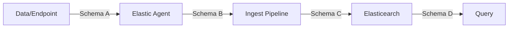

# Data schemas

In order to understand how generating sample data for Elastic integrations works you need to understand what kind of data you may be interested in.

## What data schemas are there?

When collecting data with Elastic Agent and shipping to Elasticsearch, there are 4 different data schemas. This is important as the data schemas look different and we must align during generation on what data schemas we are talking about. In the diagram below, the schemas A, B, C and D are shown:

* **Schema A**: This is the schema the Elastic Agent collects. It could be a line in a log file, response of an http request, syslog event etc. The Elastic Agent input knows how to handle this structure.
* **Schema B**: This is the schema the Elastic Agent ships to Elasticsearch (to the ingest pipeline). This is a JSON document which contains all the processing the Elastic Agent did on schema A. For example the content of the log line is the in the message field and meta information around the host was added to the event.
* **Schema C**: In case an ingest pipeline exists, the ingest pipeline converts schema B to schema C. This can be taking apart a log message with grok or enriching data with geoip. If there is no ingest pipeline, schema B and C are equal.
* **Schema D**: This is the schema users write queries on in Elasticsearch. Schema C can be different from D in the scenario of runtime fields, otherwise C and D are equal.

Schema C is the one that is defined in integration packages in the `fields.yml` files for each data stream.

## What data schemas are we interested in?

Schema A, as it removes the need for a working infrastructure to pull data from, simplifying testing setups.

Schema B, as it removes the need for a running Elastic Agent to process data from source, allowing to test ingest pipelines. Another goal for Schema B generation is to generate [rally tracks](https://github.com/elastic/rally-tracks) that can be used for performance testing.
